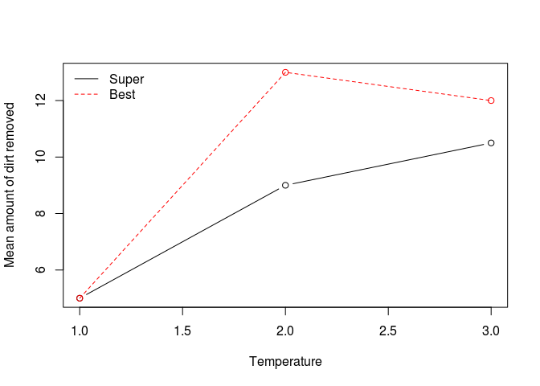

# Two-way ANOVA


```r
Y=c(4,5,6,5,7,9,8,12,10,12,11,9,6,6,4,4,13,15,12,12,12,13,10,13)
D=as.factor(c(rep(1,12), rep(2,12)))
T=as.factor(rep(c(rep(1,4),rep(2,4),rep(3,4)),2))
#cbind(Y,D,T)
### visualization
d1=which(D=="1")
d2=which(D=="2")
t1=which(T=="1")
t2=which(T=="2")
t3=which(T=="3")

d1t1=mean(as.numeric(Y[d1][t1]), na.rm=TRUE)
d1t2=mean(as.numeric(Y[d1][t2]), na.rm=TRUE)
d1t3=mean(as.numeric(Y[d1][t3]), na.rm=TRUE)
d2t1=mean(as.numeric(Y[d2][t1]), na.rm=TRUE)
d2t2=mean(as.numeric(Y[d2][t2]), na.rm=TRUE)
d2t3=mean(as.numeric(Y[d2][t3]), na.rm=TRUE)
d.max=max(c(d1t1,d1t2,d1t3,d2t1,d2t2,d2t3))
plot(1:3, c(d1t1,d1t2,d1t3), lty=1, ylim=c(5, d.max), type="b", xlab="Temperature",
ylab="Mean amount of dirt removed", col=1)
points(1:3, c(d2t1,d2t2,d2t3), col=2)
lines(1:3, c(d2t1,d2t2,d2t3), lty=2, col=2)
legend("topleft", c("Super","Best"), lty=1:2,col=1:2, bty="n")
```

 

```r
# with interaction
lm.1=lm(Y~D+T+D*T)
anova(lm.1)
```

```
## Analysis of Variance Table
## 
## Response: Y
##           Df  Sum Sq Mean Sq F value   Pr(>F)    
## D          1  20.167  20.167  9.8108 0.005758 ** 
## T          2 200.333 100.167 48.7297 5.44e-08 ***
## D:T        2  16.333   8.167  3.9730 0.037224 *  
## Residuals 18  37.000   2.056                     
## ---
## Signif. codes:  0 '***' 0.001 '**' 0.01 '*' 0.05 '.' 0.1 ' ' 1
```

```r
# without interaction
lm.2=lm(Y~D+T)
anova(lm.2)
```

```
## Analysis of Variance Table
## 
## Response: Y
##           Df  Sum Sq Mean Sq F value    Pr(>F)    
## D          1  20.167  20.167  7.5625   0.01235 *  
## T          2 200.333 100.167 37.5625 1.688e-07 ***
## Residuals 20  53.333   2.667                      
## ---
## Signif. codes:  0 '***' 0.001 '**' 0.01 '*' 0.05 '.' 0.1 ' ' 1
```

