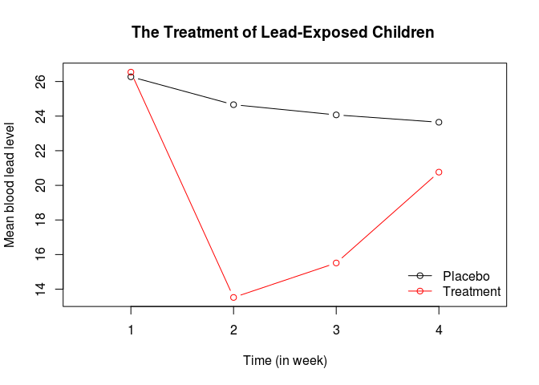
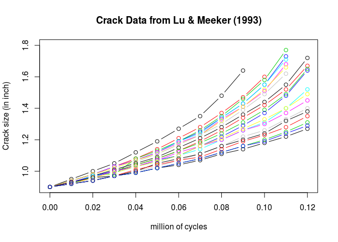

# Intro to Longitudinal data Analysis


```r
# Example #1
lead <- read.table("http://people.usm.maine.edu/cpeng/sta582/leadnew.dat")
pl.id=which(lead$V2=="P")
tr.id=which(lead$V2=="A")
placebo=lead[pl.id,][,c(3,4,5,6)]
treatment=lead[tr.id,][,c(3,4,5,6)]
####
placebo.ave=as.vector(apply(placebo, 2, mean))
treatment.ave=as.vector(apply(treatment, 2, mean))
up.lim=max(c(placebo.ave, treatment.ave))
low.lim=min(c(placebo.ave, treatment.ave))
week=1:4
plot(week, placebo.ave, ylim=c(low.lim,up.lim), xlim=c(0.5,4.5), type="b",
 xlab="Time (in week)", ylab="Mean blood lead level", col=1)
lines(week, treatment.ave, type="b", col=2)
title("The Treatment of Lead-Exposed Children ")
legend("bottomright", c("Placebo", "Treatment"), lty=rep(1,2),
pch=rep(1,2),col=1:2, bty="n")
```

 

```r
# Example #2
y1= c(0.90,0.95,1.00,1.05,1.12,1.19,1.27,1.35,1.48,1.64)
y2= c(0.90,0.94,0.98,1.03,1.08,1.14,1.21,1.28,1.37,1.47,1.60 )
y3= c(0.90,0.94,0.98,0.98,1.08,1.13,1.19,1.26,1.35,1.46,1.58,1.77)
y4= c(0.90,0.94,0.98,1.03,1.07,1.12,1.19,1.25,1.34,1.43,1.55,1.73)
y5= c(0.90,0.94,0.98,1.03,1.07,1.12,1.19,1.24,1.34,1.43,1.55,1.71)
y6= c(0.90,0.94,0.98,1.03,1.07,1.12,1.18,1.23,1.33,1.41,1.51,1.68)
y7= c(0.90,0.94,0.98,1.02,1.07,1.11,1.17,1.23,1.32,1.41,1.52,1.66)
y8= c(0.90,0.93,0.97,1.00,1.06,1.11,1.17,1.23,1.30,1.39,1.49,1.62)
y9= c(0.90,0.92,0.97,1.01,1.05,1.09,1.15,1.21,1.28,1.36,1.44,1.55,1.72)
y10=c(0.90,0.92,0.96,1.00,1.04,1.08,1.13,1.19,1.26,1.34,1.42,1.52,1.67)
y11=c(0.90,0.93,0.96,1.00,1.04,1.08,1.13,1.18,1.24,1.31,1.39,1.49,1.65)
y12=c(0.90,0.93,0.97,1.00,1.03,1.07,1.10,1.16,1.22,1.29,1.37,1.48,1.64)
y13=c(0.90,0.92,0.97,0.99,1.03,1.06,1.10,1.14,1.20,1.26,1.31,1.40,1.52)
y14=c(0.90,0.93,0.96,1.00,1.03,1.07,1.12,1.16,1.20,1.26,1.30,1.37,1.45)
y15=c(0.90,0.92,0.96,0.99,1.03,1.06,1.10,1.16,1.21,1.27,1.33,1.40,1.49)
y16=c(0.90,0.92,0.95,0.97,1.00,1.03,1.07,1.11,1.16,1.22,1.26,1.33,1.40)
y17=c(0.90,0.93,0.96,0.97,1.00,1.05,1.08,1.11,1.16,1.20,1.24,1.32,1.38)
y18=c(0.90,0.92,0.94,0.97,1.01,1.04,1.07,1.09,1.14,1.19,1.23,1.28,1.35)
y19=c(0.90,0.92,0.94,0.97,0.99,1.02,1.05,1.08,1.12,1.16,1.20,1.25,1.31)
y20=c(0.90,0.92,0.94,0.97,0.99,1.02,1.05,1.08,1.12,1.16,1.19,1.24,1.29)
y21=c(0.90,0.92,0.94,0.97,0.99,1.02,1.04,1.07,1.11,1.14,1.18,1.22,1.27)
x=(0:12)*0.01

plot(x,y21,xlim=c(0,0.12),ylim=c(0.9,1.8),xlab="million of cycles",
ylab="Crack size (in inch)",type="b")
lines(x[1:10],y1,type="b", col=1)
lines(x[1:11],y2,type="b", col=2)
lines(x[1:12],y3,type="b", col=3)
lines(x[1:12],y4,type="b", col=4)
lines(x[1:12],y5,type="b", col=5)
lines(x[1:12],y6,type="b", col=6)
lines(x[1:12],y7,type="b", col=7)
lines(x[1:12],y8,type="b", col=8)
lines(x,y9,type="b", col=9)
lines(x,y10,type="b", col=10)
lines(x,y11,type="b", col=11)
lines(x,y12,type="b", col=12)
lines(x,y13,type="b", col=13)
lines(x,y14,type="b", col=14)
lines(x,y15,type="b", col=15)
lines(x,y16,type="b", col=16)
lines(x,y17,type="b", col=17)
lines(x,y18,type="b", col=18)
lines(x,y19,type="b", col=19)
lines(x,y20,type="b", col=20)
title("Crack Data from Lu & Meeker (1993)")
```

 

