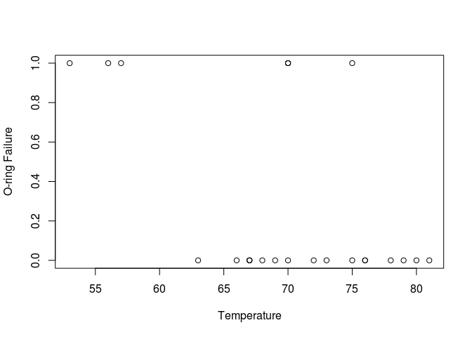

# Logistic Regression


```r
Y = c(rep(1,3), rep(0,8), rep(1,3), rep(0,3), 1, rep(0,6))
X=c(53,56,57,63,66,67,67,67,68,69,70,70,70,70,72,73,75,75,76,76,78,79,80,81)
# cbind(X,Y)
plot(X,Y,xlab="Temperature",ylab="O-ring Failure")
```

 

```r
Y = c(rep(1,3), rep(0,8), rep(1,3), rep(0,3), 1, rep(0,6))
X=c(53,56,57,63,66,67,67,67,68,69,70,70,70,70,72,73,75,75,76,76,78,79,80,81)
# cbind(X,Y)
Logit.m= glm(Y~X, family=binomial)
summary(Logit.m)
```

```
## 
## Call:
## glm(formula = Y ~ X, family = binomial)
## 
## Deviance Residuals: 
##     Min       1Q   Median       3Q      Max  
## -1.2125  -0.8253  -0.4706   0.5907   2.0512  
## 
## Coefficients:
##             Estimate Std. Error z value Pr(>|z|)  
## (Intercept) 10.87535    5.70291   1.907   0.0565 .
## X           -0.17132    0.08344  -2.053   0.0400 *
## ---
## Signif. codes:  0 '***' 0.001 '**' 0.01 '*' 0.05 '.' 0.1 ' ' 1
## 
## (Dispersion parameter for binomial family taken to be 1)
## 
##     Null deviance: 28.975  on 23  degrees of freedom
## Residual deviance: 23.030  on 22  degrees of freedom
## AIC: 27.03
## 
## Number of Fisher Scoring iterations: 4
```

```r
X1=cbind(rep(1,length(X)), X)
Xb = X1%*% Logit.m $coefficients
phat = exp(Xb)/(1+exp(Xb))
phat
```

```
##             [,1]
##  [1,] 0.85758349
##  [2,] 0.78268818
##  [3,] 0.75214414
##  [4,] 0.52052785
##  [5,] 0.39369565
##  [6,] 0.35362920
##  [7,] 0.35362920
##  [8,] 0.35362920
##  [9,] 0.31551837
## [10,] 0.27973723
## [11,] 0.24655222
## [12,] 0.24655222
## [13,] 0.24655222
## [14,] 0.24655222
## [15,] 0.18850910
## [16,] 0.16368693
## [17,] 0.12199327
## [18,] 0.12199327
## [19,] 0.10479854
## [20,] 0.10479854
## [21,] 0.07672851
## [22,] 0.06543827
## [23,] 0.05570909
## [24,] 0.04735313
```

```r
anova(Logit.m, test = 'Chisq')
```

```
## Analysis of Deviance Table
## 
## Model: binomial, link: logit
## 
## Response: Y
## 
## Terms added sequentially (first to last)
## 
## 
##      Df Deviance Resid. Df Resid. Dev Pr(>Chi)  
## NULL                    23     28.975           
## X     1   5.9441        22     23.030  0.01477 *
## ---
## Signif. codes:  0 '***' 0.001 '**' 0.01 '*' 0.05 '.' 0.1 ' ' 1
```
