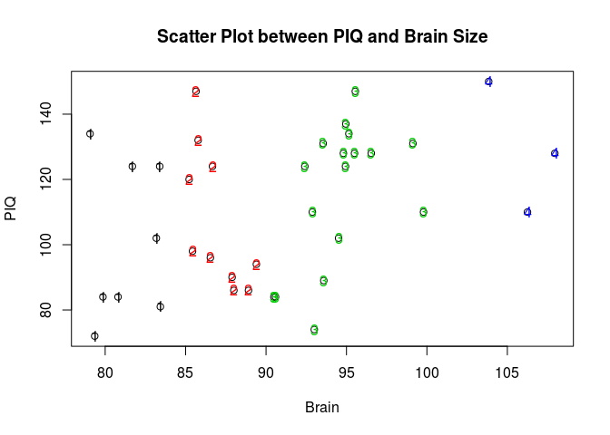

# STA582_ANOVA

ANOVA with R


```r
y1=c(29,28,23,26,26,19,25,29,26,28)
y2=c(17,25,24,19,28,21,20,25,19,24)
y3=c(17,16,21,22,23,18,20,17,25,21)
y4=c(18,20,25,24,16,20,20,17,19,17)
y=c(y1, y2, y3, y4)
fctr=rep(c(1,2,3,4), each=10)
datset=as.data.frame(cbind(y, fctr))
#######
summary(factor(fctr))
```

```
##  1  2  3  4 
## 10 10 10 10
```

```r
m.anova=lm(y~factor(fctr), data=datset)
summary(m.anova)
```

```
## 
## Call:
## lm(formula = y ~ factor(fctr), data = datset)
## 
## Residuals:
##    Min     1Q Median     3Q    Max 
##   -6.9   -2.6    0.1    2.1    5.8 
## 
## Coefficients:
##               Estimate Std. Error t value Pr(>|t|)    
## (Intercept)    25.9000     0.9873  26.234  < 2e-16 ***
## factor(fctr)2  -3.7000     1.3962  -2.650 0.011883 *  
## factor(fctr)3  -5.9000     1.3962  -4.226 0.000155 ***
## factor(fctr)4  -6.3000     1.3962  -4.512  6.6e-05 ***
## ---
## Signif. codes:  0 '***' 0.001 '**' 0.01 '*' 0.05 '.' 0.1 ' ' 1
## 
## Residual standard error: 3.122 on 36 degrees of freedom
## Multiple R-squared:  0.4159,	Adjusted R-squared:  0.3672 
## F-statistic: 8.545 on 3 and 36 DF,  p-value: 0.0002043
```

```r
datset$fctr <- factor(datset$fctr)
m1 <- lm(y ~ fctr, data = datset)
datset <- within(datset, fctr <- relevel(datset$fctr, "3"))
m2 <- lm(y ~ fctr, data = datset)
summary(m1)
```

```
## 
## Call:
## lm(formula = y ~ fctr, data = datset)
## 
## Residuals:
##    Min     1Q Median     3Q    Max 
##   -6.9   -2.6    0.1    2.1    5.8 
## 
## Coefficients:
##             Estimate Std. Error t value Pr(>|t|)    
## (Intercept)  25.9000     0.9873  26.234  < 2e-16 ***
## fctr2        -3.7000     1.3962  -2.650 0.011883 *  
## fctr3        -5.9000     1.3962  -4.226 0.000155 ***
## fctr4        -6.3000     1.3962  -4.512  6.6e-05 ***
## ---
## Signif. codes:  0 '***' 0.001 '**' 0.01 '*' 0.05 '.' 0.1 ' ' 1
## 
## Residual standard error: 3.122 on 36 degrees of freedom
## Multiple R-squared:  0.4159,	Adjusted R-squared:  0.3672 
## F-statistic: 8.545 on 3 and 36 DF,  p-value: 0.0002043
```

```r
summary(m2)
```

```
## 
## Call:
## lm(formula = y ~ fctr, data = datset)
## 
## Residuals:
##    Min     1Q Median     3Q    Max 
##   -6.9   -2.6    0.1    2.1    5.8 
## 
## Coefficients:
##             Estimate Std. Error t value Pr(>|t|)    
## (Intercept)  20.0000     0.9873  20.258  < 2e-16 ***
## fctr1         5.9000     1.3962   4.226 0.000155 ***
## fctr2         2.2000     1.3962   1.576 0.123849    
## fctr4        -0.4000     1.3962  -0.286 0.776148    
## ---
## Signif. codes:  0 '***' 0.001 '**' 0.01 '*' 0.05 '.' 0.1 ' ' 1
## 
## Residual standard error: 3.122 on 36 degrees of freedom
## Multiple R-squared:  0.4159,	Adjusted R-squared:  0.3672 
## F-statistic: 8.545 on 3 and 36 DF,  p-value: 0.0002043
```

```r
anova(m.anova)
```

```
## Analysis of Variance Table
## 
## Response: y
##              Df Sum Sq Mean Sq F value    Pr(>F)    
## factor(fctr)  3 249.87  83.292  8.5452 0.0002043 ***
## Residuals    36 350.90   9.747                      
## ---
## Signif. codes:  0 '***' 0.001 '**' 0.01 '*' 0.05 '.' 0.1 ' ' 1
```


```r
plot(factor(datset$fctr), datset$y, col = "mistyrose1")
```

 


```r
piq=read.table("http://people.usm.maine.edu/cpeng/STA582/PIQ.txt", header=T)
PIQ=piq$PIQ
Brain=piq$Brain


cate.brain = ifelse(Brain<85, 1,
              ifelse(Brain<90,2,
                ifelse(Brain<100,3, 4)))
cate.brain 
```

```
##  [1] 1 4 3 3 3 3 2 3 3 1 4 3 2 2 2 2 3 1 2 3 1 3 1 3 1 4 1 2 2 3 3 2 1 3 3
## [36] 2 3 3
```

```r
id.1=which(cate.brain==1)
id.2=which(cate.brain==2)
id.3=which(cate.brain==3)
id.4=which(cate.brain==4)

plot(Brain, PIQ, main="Scatter Plot between PIQ and Brain Size") 
points(Brain[id.1], PIQ[id.1],col=1, pch="1")
points(Brain[id.2], PIQ[id.2],col=2, pch="2")
points(Brain[id.3], PIQ[id.3],col=3, pch="3")
points(Brain[id.4], PIQ[id.4],col=4, pch="4")
```

 

