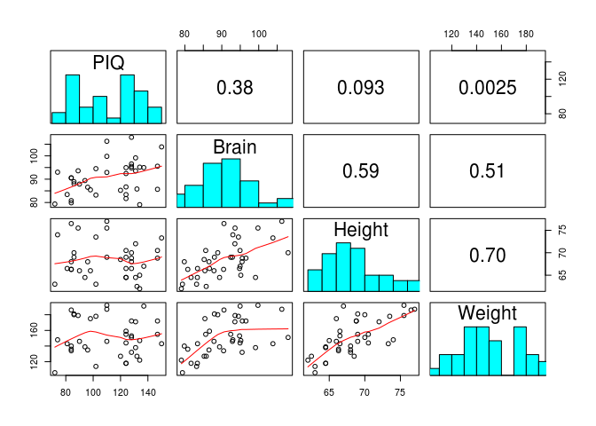
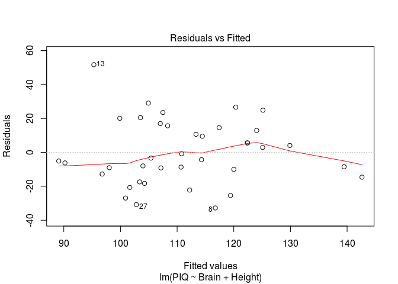
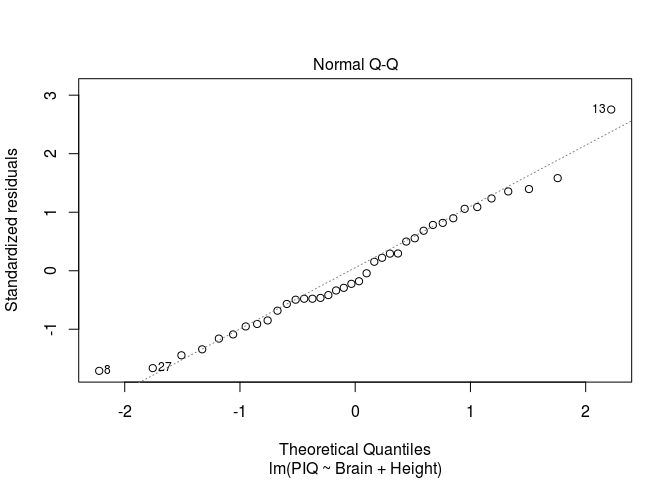
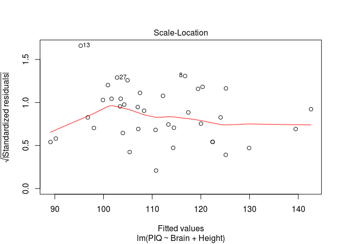
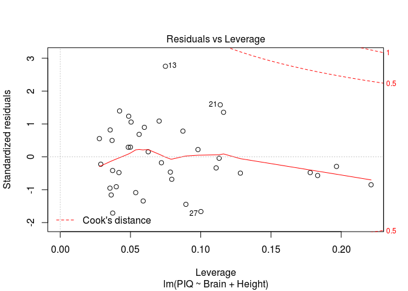

# STA582 Linear Regression

Does a person's IQ depend on their brain size, height and weight?

Load the data:


```r
piq=read.table("http://people.usm.maine.edu/cpeng/STA582/PIQ.txt", header=T)
```


Explore pairwise relationships:


```r
# Helper functions
panel.cor <- function(x, y, digits = 2, prefix = "", cex.cor, ...)
{
  usr <- par("usr"); on.exit(par(usr))
  par(usr = c(0, 1, 0, 1))
  r <- abs(cor(x, y))
  txt <- format(c(r, 0.123456789), digits = digits)[1]
  txt <- paste0(prefix, txt)
  if(missing(cex.cor)) cex.cor <- 0.8/strwidth(txt)
  text(0.5, 0.5, txt, cex = 2)
}
panel.hist <- function(x, ...)
{
  usr <- par("usr"); on.exit(par(usr))
  par(usr = c(usr[1:2], 0, 1.5) )
  h <- hist(x, plot = FALSE)
  breaks <- h$breaks; nB <- length(breaks)
  y <- h$counts; y <- y/max(y)
  rect(breaks[-nB], 0, breaks[-1], y, col = "cyan", ...)
}

# Create pairwise scatter plots
pairs(piq, diag.panel = panel.hist, lower.panel = panel.smooth, upper.panel = panel.cor)
```

 


Manual Calculation using matrix operations

```r
PIQ=piq$PIQ
Brain=piq$Brain
Height=piq$Height
Weight=piq$Weight
Y = PIQ
n=length(Y)
X=cbind(rep(1,n),Brain, Height)
p=3
## LSE of regression coefficients
b = solve(t(X)%*%X)%*%t(X)%*%Y
b
```

```
##              [,1]
##        111.275670
## Brain    2.060649
## Height  -2.729928
```

```r
### Residuals
E=Y-(b[1]+b[2]*Brain+b[3]*Height)
mean(E)
```

```
## [1] 1.257287e-12
```

```r
MSE=as.numeric(t(E)%*%E/(n-p))
MSE
```

```
## [1] 380.6232
```

```r
Vb=MSE*solve(t(X)%*%X)
Vb
```

```
##                         Brain      Height
##        3121.157622 -5.2393881 -38.5269660
## Brain    -5.239388  0.2988164  -0.3194342
## Height  -38.526966 -0.3194342   0.9864202
```

```r
SE=sqrt(diag(Vb))
SE
```

```
##                 Brain     Height 
## 55.8673216  0.5466410  0.9931869
```

```r
TS=b/SE
TS
```

```
##             [,1]
##         1.991785
## Brain   3.769657
## Height -2.748655
```

```r
pval=2*(1-pt(abs(TS),n-p))
pval
```

```
##                [,1]
##        0.0542426786
## Brain  0.0006044845
## Height 0.0093990641
```

```r
#####
Result=cbind(par=b, se=SE, T=TS, Pval=pval)
colnames(Result)=c("LSE", "se", "TS", "P(|t|>TS)")
rownames(Result)=c("Intercept", "Brain","Height")
Result
```

```
##                  LSE         se        TS    P(|t|>TS)
## Intercept 111.275670 55.8673216  1.991785 0.0542426786
## Brain       2.060649  0.5466410  3.769657 0.0006044845
## Height     -2.729928  0.9931869 -2.748655 0.0093990641
```


Using built-in function: lm()

```r
m0=lm(PIQ~Brain+Height)
summary(m0)
```

```
## 
## Call:
## lm(formula = PIQ ~ Brain + Height)
## 
## Residuals:
##     Min      1Q  Median      3Q     Max 
## -32.750 -12.090  -3.841  14.174  51.690 
## 
## Coefficients:
##             Estimate Std. Error t value Pr(>|t|)    
## (Intercept) 111.2757    55.8673   1.992 0.054243 .  
## Brain         2.0606     0.5466   3.770 0.000604 ***
## Height       -2.7299     0.9932  -2.749 0.009399 ** 
## ---
## Signif. codes:  0 '***' 0.001 '**' 0.01 '*' 0.05 '.' 0.1 ' ' 1
## 
## Residual standard error: 19.51 on 35 degrees of freedom
## Multiple R-squared:  0.2949,	Adjusted R-squared:  0.2546 
## F-statistic: 7.321 on 2 and 35 DF,  p-value: 0.002208
```


Model Diagnostics

```r
#par(mfrow=c(2,2))
plot(m0)
```

    


