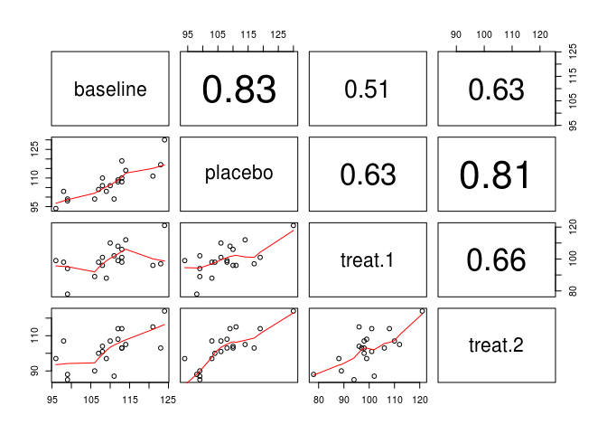

# Single Group Repeated Measure


```r
dbp = read.table("http://people.usm.maine.edu/cpeng/STA582/dbp.dat")
colnames(dbp)=c("pid", "baseline", "placebo", "treat.1", "treat.2")
panel.cor = function(x, y, digits = 2, prefix = "", cex.cor){
 usr = par("usr"); on.exit(par(usr))
 par(usr = c(0, 1, 0, 1))
 r = abs(cor(x, y))
 txt = format(c(r, 0.123456789), digits = digits)[1]
 txt = paste0(prefix, txt)
 if(missing(cex.cor)) cex.cor = 0.8/strwidth(txt)
 text(0.5, 0.5, txt, cex = cex.cor * r)
}
pairs(dbp[,-1], lower.panel = panel.smooth, upper.panel = panel.cor)
```

 

```r
colnames(dbp)=c("pid", "baseline", "placebo", "treat.1", "treat.2")
######## Make a long table for modeling
ID=rep(dbp$pid, 4)
dbpvec=c(dbp$baseline, dbp$placebo, dbp$treat.1, dbp$treat.2)
time=rep(c(1,2,3,4), each=length(dbp$pid))
longdata=as.data.frame(cbind(ID, dbpvec, time))
## one-way RM ANOVA
anova.m1=aov(dbpvec~factor(time)+Error(factor(ID)),data=longdata)
summary(anova.m1)
```

```
## 
## Error: factor(ID)
##           Df Sum Sq Mean Sq F value Pr(>F)
## Residuals 19   4567   240.3               
## 
## Error: Within
##              Df Sum Sq Mean Sq F value   Pr(>F)    
## factor(time)  3   1278   426.0   16.16 1.02e-07 ***
## Residuals    57   1503    26.4                     
## ---
## Signif. codes:  0 '***' 0.001 '**' 0.01 '*' 0.05 '.' 0.1 ' ' 1
```

```r
## classical one-way ANOVA
anova.m0=aov(dbpvec~factor(time),data=longdata)
summary(anova.m0)
```

```
##              Df Sum Sq Mean Sq F value  Pr(>F)   
## factor(time)  3   1278   426.0   5.334 0.00218 **
## Residuals    76   6070    79.9                   
## ---
## Signif. codes:  0 '***' 0.001 '**' 0.01 '*' 0.05 '.' 0.1 ' ' 1
```

