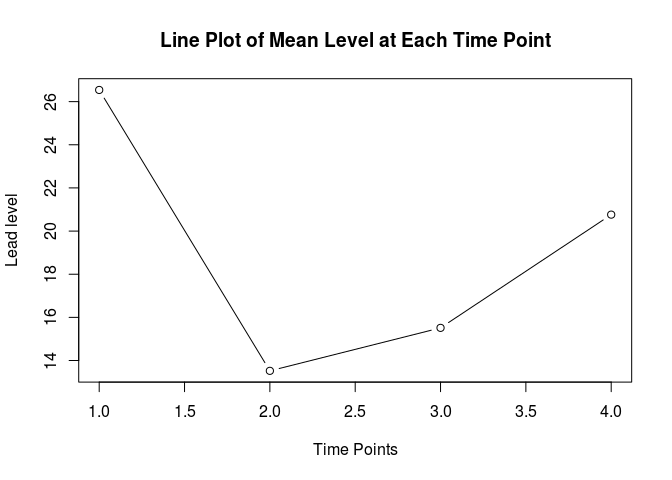

# Trend Analysis with RM-ANOVA


```r
lead = read.table("http://people.usm.maine.edu/cpeng/sta582/leadlevel.txt", header = T)
ave=as.vector(apply(lead, 2, mean))[-1]
plot(1:4, ave, type="b", xlab="Time Points", ylab="Lead level")
title("Line Plot of Mean Level at Each Time Point")
```

 


```r
ID=rep(lead$ID,4)
time=sort(rep(1:4,50))
level=c(lead[,2],lead[,3],lead[,4],lead[,5])
leadlevel=cbind(level, ID, time)
anova.m=aov(level~factor(ID)+factor(time)+Error(ID))
summary(anova.m)
```

```
## 
## Error: ID
##            Df Sum Sq Mean Sq
## factor(ID)  1 0.4438  0.4438
## 
## Error: Within
##               Df Sum Sq Mean Sq F value   Pr(>F)    
## factor(ID)    48   6914     144   4.795 1.19e-13 ***
## factor(time)   3   5104    1702  56.641  < 2e-16 ***
## Residuals    147   4416      30                     
## ---
## Signif. codes:  0 '***' 0.001 '**' 0.01 '*' 0.05 '.' 0.1 ' ' 1
```


```r
contr=c(3,-1,-1,-1)
MSR=30
N=50
df1=1
df2=147
Q=sum(ave*contr) ## 29.82
TS=Q/sqrt(MSR*sum(contr^2)/N) ## 29.82/2.68 = 11.1
pval=2*min(pt(TS, df2),1-pt(TS, df2))
pval 
```

```
## [1] 0
```


```r
# generate orthonormal contrast
codes <- contr.poly(4)
abs.coef.min=apply(abs(codes),2,min)
L=codes[,1]/abs.coef.min[1]
Q=codes[,2]/abs.coef.min[2]
C=codes[,3]/abs.coef.min[3]
contr.int=cbind(L, Q, C)
contr.int
```

```
##       L  Q  C
## [1,] -3  1 -1
## [2,] -1 -1  3
## [3,]  1 -1 -3
## [4,]  3  1  1
```


```r
sum.L=sum(L^2)
sum.Q=sum(Q^2)
sum.C=sum(C^2)
c(sum.L, sum.Q, sum.C)
```

```
## [1] 20  4 20
```


```r
MSR=30; N=50
SSL=N*(sum(codes[,1]*ave))^2/sum(codes[,1]^2)
SSQ=N*(sum(codes[,2]*ave))^2/sum(codes[,2]^2)
SSC=N*(sum(codes[,3]*ave))^2/sum(codes[,3]^2)
SSL+SSQ+SSC
```

```
## [1] 5104.418
```

```r
SS.LQC=cbind(SSL,SSQ,SSC);SS.LQC
```

```
##           SSL      SSQ      SSC
## [1,] 588.4424 4170.584 345.3913
```

```r
F.LQC = SS.LQC/MSR;F.LQC
```

```
##           SSL      SSQ      SSC
## [1,] 19.61475 139.0195 11.51304
```

```r
pval.L=2*min(pf(F.LQC[1],1,147), 1 -pf(F.LQC[1],1,147))
pval.Q=2*min(pf(F.LQC[2],1,147), 1 -pf(F.LQC[2],1,147))
pval.C=2*min(pf(F.LQC[3],1,147), 1 -pf(F.LQC[3],1,147))
cbind(pval.L, pval.Q,pval.C)
```

```
##            pval.L pval.Q      pval.C
## [1,] 3.676133e-05      0 0.001776588
```

